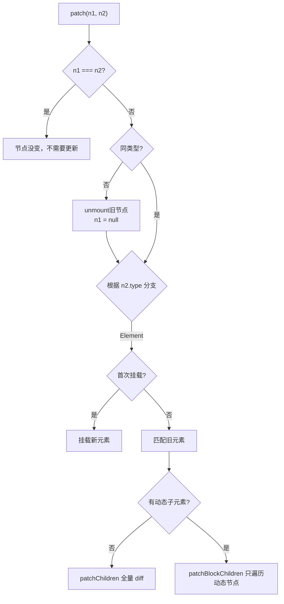
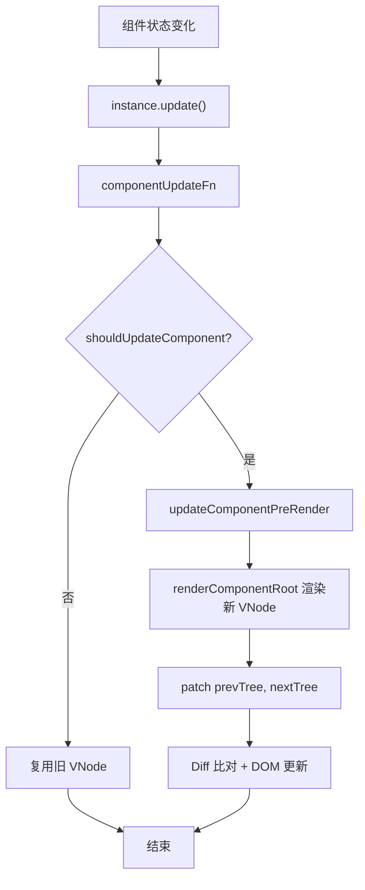

Vue3 中虚拟 DOM 的实现在 `runtime-core/src/renderer.ts` 文件中。其中包含虚拟 DOM 更新流程和核心的 Diff 算法。

`renderer.ts` 中的关键实现是 `baseCreateRenderer`，`baseCreateRenderer` 返回 `render`、`hydrate`（SSR 相关）、`createApp`。

`createApp` 中可以看到常用的方法：`use`、`mixin`、`component`、`directive`、`mount`、`onUnmount`、`unmount`、`provide`。这些都非常熟悉不再赘述。

`baseCreateRenderer` 中最核心的是 **Patch** 方法。我们从这个方法可以了解到整个虚拟DOM挂载和更新的流程；

---

## 一、Patch 递归

**Patch 方法是 Diff 算法入口**，通过递归对 VNode "打补丁" 更新 DOM。`patch` 会接受新旧节点，判断两个 VNode 的关系并执行相应操作：

1. **相同节点**（`n1 === n2`）→ 直接返回
2. **类型不同** → 卸载旧树，挂载新树
3. **按 `type` 分发处理**：

| type | 处理函数 | 说明 |
|------|---------|------|
| `Text` | `processText` | 文本节点 |
| `Comment` | `processCommentNode` | 注释节点 |
| `Static` | `mountStaticNode` / `patchStaticNode` | 编译优化后的静态节点 |
| `Fragment` | `processFragment` | 片段 |
| Element | `processElement` → `mountElement` / `patchElement` | 普通元素 |
| Component | `processComponent` → `mountComponent` / `updateComponent` | 组件 |
| Teleport | 调用 Teleport 自身的 process | 传送门 |
| Suspense | 调用 Suspense 自身的 process | 异步组件 |

### patchFlag 优化

**patchFlag** 是在生成 VNode 阶段产生的，它标记了元素哪些部分是动态的，用来在 Diff 中进行性能优化。

### 流程图



---

## 二、Diff 核心

Diff 算法是降低 DOM 渲染频率以提升 Vue 性能的算法。算法的思想是降低真实DOM的增删操作，尽量复用旧的节点。

在 Patch 递归过程中只能处理单节点嵌套，而消耗大量性能的多子节点更新最终会在 `patchChildren` 中处理。

### 两种情形

- **有 key**：进行头尾匹配，再对中间无序区间进行最长递增子序列进行节点移动性能优化
- **无 key**：按索引一一对比，多余旧节点卸载，多余新节点挂载

其中对于有 key 属性的子节点处理就是整个 Diff 性能优化最核心的地方。

### 有 key 的 Diff 流程

1. **从头同步**：双指针从开头向中间移动，逐个比对，相同则 patch
2. **从尾同步**：双指针从结尾向中间移动，逐个比对，相同则 patch
3. **处理剩余**：
   - 旧节点先遍历完 → 剩余新节点挂载
   - 新节点先匹配完 → 剩余旧节点卸载
4. **乱序处理**：构建新节点 key → index 映射，遍历旧节点匹配更新，通过最长递增子序列计算最少移动

**伪代码**：

```
function patchKeyedChildren(旧列表, 新列表):
    i = 0                    // 起始指针
    e1 = 旧列表.length - 1   // 旧列表末尾
    e2 = 新列表.length - 1   // 新列表末尾

    // 1. 头同步：从头逐个比对，相同则 patch，指针后移
    while i <= e1 && i <= e2 && 旧列表[i] 与 新列表[i] 类型相同:
        patch(旧列表[i], 新列表[i])
        i++

    // 2. 尾同步：从尾逐个比对，相同则 patch，末尾前移
    while i <= e1 && i <= e2 && 旧列表[e1] 与 新列表[e2] 类型相同:
        patch(旧列表[e1], 新列表[e2])
        e1--; e2--

    // 3. 剩余处理
    if i > e1:                // 旧节点遍历完，新节点还有
        挂载剩余新节点
    else if i > e2:          // 新节点匹配完，旧节点还有
        卸载剩余旧节点
    else:
        // 4. 乱序部分
        建立 新列表 key → index 的映射表

        遍历旧列表:
            根据 key 在映射表中查找对应新节点
            if 找到:
                patch 该节点
                记录"新节点位置 → 旧节点位置"的对应关系
                判断是否需要移动（位置递减 = 需要移动）
            else:
                卸载该旧节点

        计算最长递增子序列（基于记录的对应关系）

        从后向前遍历新列表:
            if 从未匹配过:
                挂载该新节点
            else if 需要移动且不在递增序列中:
                移动该节点到正确位置
```

**核心思想**：通过最长递增子序列找出不需要移动的节点，只移动必须移动的节点，最小化 DOM 操作。

---

## 三、组件更新

组件更新流程分为两种触发方式：**内部状态变化** 和 **父组件更新**。

### 触发方式

| 触发方式 | 说明 |
|---------|------|
| 内部状态变化 | 组件自己的响应式数据变化，触发 `instance.update()` |
| 父组件更新 | 父组件传入新的 VNode，触发 patch |

### 核心流程



#### 1. `updateComponent` - 判断是否需要更新

```
function updateComponent(旧VNode, 新VNode):
    从 新VNode 获取组件实例

    if 应该更新(旧VNode, 新VNode):
        if 是异步组件且未解析完成:
            只更新 props 和 slots
        else:
            缓存新 VNode
            触发组件的响应式 effect（执行渲染函数）
    else:
        直接复用旧 VNode 的 DOM 元素
```

#### 2. `componentUpdateFn` - 渲染 effect 核心

```
function componentUpdateFn():
    if 未挂载:
        执行挂载流程
    else:
        // 更新流程
        if 有待处理的 VNode:
            更新组件的 props 和 slots

        执行 beforeUpdate 生命周期钩子

        // 渲染
        新子树 = 执行组件的 render 函数（生成新 VNode）
        旧子树 = 当前保存的子树

        // 比对
        patch(旧子树, 新子树)

        执行 updated 生命周期钩子
```

#### 3. `updateComponentPreRender` - 更新组件内部状态

```
function updateComponentPreRender(组件实例, 新VNode):
    更新组件实例的 vnode 引用
    清空待处理的 next
    更新 props
    更新 slots
    刷新前置队列中的回调
```

### 生命周期顺序

```
beforeUpdate → 渲染新 VNode → patch → updated
```

---

## 四、Fragment & Teleport 等特殊 VNode 的处理

### Fragment

Fragment 用于处理多个根节点的情况，如模板编译产生的 `<></>` 或 `v-for` 生成的片段。

**特点**：没有单个 DOM 元素作为根，需要用两个锚点（startAnchor/endAnchor）包裹。

#### 语义化描述

```
function processFragment(旧VNode, 新VNode, 容器, 锚点):
    // 创建两个锚点标记片段边界
    创建片段起始锚点
    创建片段结束锚点

    if 首次挂载:
        将两个锚点插入容器
        遍历子节点逐个挂载到两个锚点之间
    else:
        if 是稳定片段且有动态子节点:
            只 patch 动态子节点（快速路径）
        else:
            全量比对子节点列表
```

#### 两种更新路径

| 路径 | 条件 | 说明 |
|------|------|------|
| 快速路径 | `STABLE_FRAGMENT` + `dynamicChildren` | 子节点顺序不变，只更新动态节点 |
| 全量路径 | 其他情况 | 调用 `patchChildren` 全量比对 |

---

### Teleport

Teleport 用于将子节点渲染到当前组件 DOM 树以外的位置，如 Modal、Toast 等场景。

**核心概念**：

- `to`：目标容器，可以是 CSS 选择器或 DOM 元素
- `disabled`：是否禁用 teleport
- `targetAnchor`：`to` 容器中的插入锚点

#### 语义化描述

```
function processTeleport(旧VNode, 新VNode, 容器, 锚点):
    if 首次挂载:
        // 1. 在原始位置插入占位锚点
        创建 teleport start 锚点
        创建 teleport end 锚点

        // 2. 挂载到目标容器
        if 未禁用:
            解析目标容器
            将子节点挂载到目标容器中

    else:
        // 更新流程
        复用旧 VNode 的锚点引用

        // 1. 处理子节点更新
        if 有动态子节点:
            快速路径 patch
        else:
            全量比对子节点

        // 2. 处理目标容器变化
        if 禁用状态变化:
            移动到对应容器（主容器或目标容器）
        else if 目标容器变化:
            移动到新的目标容器
```

#### 三种移动类型

| 类型 | 说明 |
|------|------|
| `TOGGLE` | enabled ↔ disabled 状态切换 |
| `TARGET_CHANGE` | 目标容器（`to` prop）变化 |
| `GLOBAL` | 未知原因需要全局移动 |

---

### Suspense

Suspense 用于处理异步组件加载状态，展示加载中/失败等 fallback UI。

（详见 `packages/runtime-core/src/components/Suspense.ts`）
